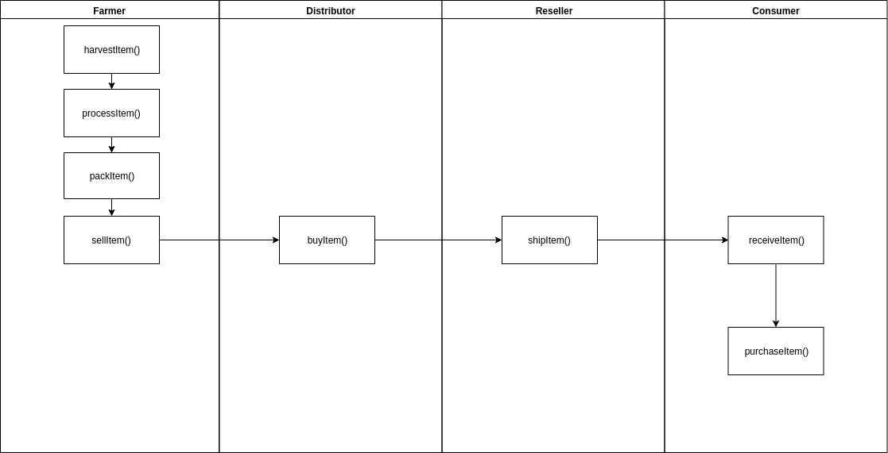
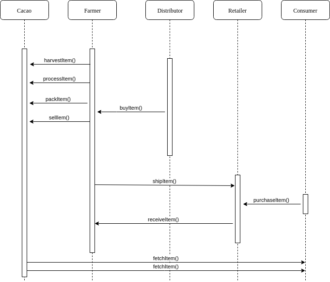
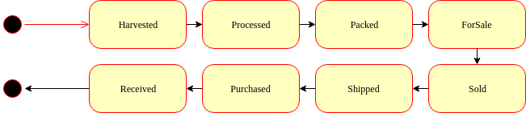
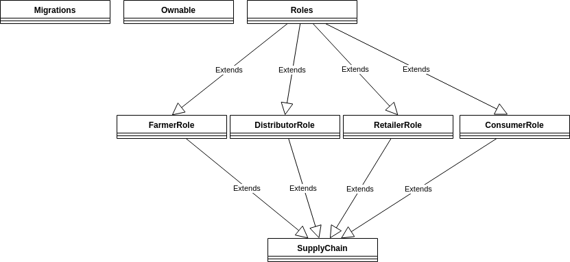

## Libraries

##### "ganache-cli": "^7.5.0"
Local Ethereum blockchain
##### "truffle": "5.6.7"
Framework for deploing smart contracts

## Version Numbers
- Truffle v5.6.4 (core: 5.6.4)
- Ganache v7.5.0
- Solidity v0.8.17 (solc-js)
- Node v16.18.1
- Web3.js v1.7.4

## UML documents
### Activity

### Sequence

### State

### Class (Data Model)
